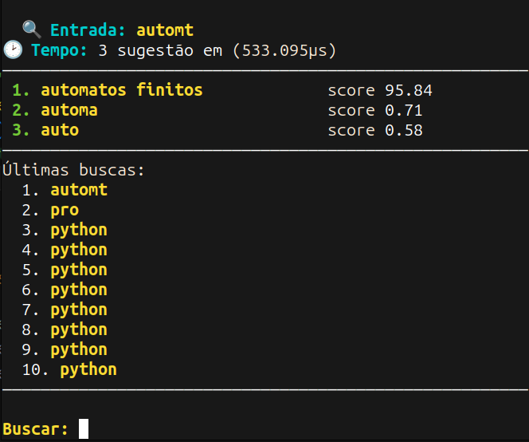
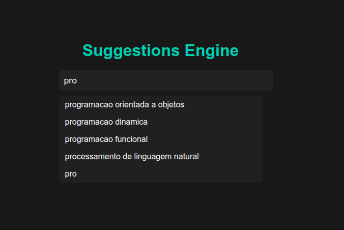

# Suggestion Engine

Um motor de sugestões leve e eficiente desenvolvido em **Golang**, utilizando **Programação Dinâmica** (algoritmo de Levenshtein), **Tries** e ferramentas nativas de análise de performance (`pprof` e `runtime`).
Este projeto nasceu de um estudo sobre algoritmos de distância de edição e evoluiu até se tornar um sistema completo com **CLI**, **API REST** e **interface web simples**.

---

## Visão geral

O objetivo é oferecer sugestões de palavras e correções automáticas em tempo real, com base em similaridade de texto e frequência de uso.
Ele combina três ideias principais:

1. **Trie** para busca eficiente por prefixo
2. **Programação Dinâmica** (Levenshtein) para calcular similaridade
3. **Ranking adaptativo** com base em frequência e distância

---

## Recursos principais

* **Busca por prefixo** instantânea
* **Correção automática** com tolerância a erros de digitação
* **Aprendizado incremental** (o sistema aprende com o uso)
* **Medições de performance reais** com `pprof`, `runtime` e `hey`
* **Baixo consumo de memória e alta taxa de requisições (~28k req/s)**
* **API REST**, **CLI interativa** e **interface web simples**

---

## Estrutura do projeto

```
.
├── cmd/
│   ├── api/      # Servidor HTTP
│   ├── cli/      # Interface de linha de comando
│   ├── seed/     # Populador inicial do dataset
│   └── main.go   # Ponto de entrada
├── engine/
│   ├── edit_distance.go   # Algoritmo de Levenshtein (PD)
│   ├── trie.go            # Estrutura Trie
│   ├── engine.go          # Núcleo de sugestões
│   ├── ranker.go          # Cálculo de relevância
│   ├── learner.go         # Aprendizado incremental
│   ├── history.go         # Histórico de consultas
│   ├── loader.go          # Carregamento do dataset
│   ├── normalize.go       # Normalização de texto
│   └── dataset_test.go    # Testes e benchmarks
├── web/
│   ├── index.html
│   └── style.css
└── go.mod
```

---

## Como executar

### 1. Clonar o repositório

```bash
git clone https://github.com/JuniorPaula/suggestion-engine.git
cd suggestion-engine
```

### 2. Executar via CLI

```bash
go run cmd/cli
```

#### Exemplo de saída:



### 3. Executar API HTTP

```bash
go run cmd/api/*.go
```

O servidor iniciará em:
`http://localhost:9696`
Endpoint de teste:

```
GET /suggest?q=pyton
```

### 4. Executar interface web

Abra o arquivo:

```
web/index.html
```

Ele consome o endpoint `/suggest`.

#### Exemplo de saída:



---

## Testes e performance

### Testes unitários e benchmark

```bash
go test ./engine -bench=. -v
```

**Saída:**

```
BenchmarkSuggest-8   	  370477	      3792 ns/op
```

### Teste de carga com `hey`

```bash
hey -n 1000 -c 20 "http://localhost:9696/suggest?q=python"
```

**Resultado:**

* 28.4k requisições/segundo
* Média de 0.6 ms por resposta
* 95% abaixo de 1.7 ms

### Análise de memória

```bash
go tool pprof http://localhost:6060/debug/pprof/heap
```

```
Alloc = 3 MiB | Sys = 13 MiB | NumGC = 11
```

O heap permanece estável mesmo sob carga contínua, comprovando a eficiência do Go.

---

## Conceitos aplicados

* **Programação Dinâmica:** usada no cálculo de distância de edição (Levenshtein)
* **Trie:** estrutura de árvore para busca de prefixos com custo O(L)
* **Ranking:** combinação entre frequência e distância para definir relevância
* **Análise assintótica:** otimização de espaço de O(n*m) → O(n)
* **Profiling:** análise de heap e CPU com `pprof`

---

## Resultados

* **Respostas em microssegundos**
* **Alocação de heap mínima (~3MB)**
* **GC previsível e rápido**
* **Alta taxa de requisições (~28k req/s)**
* **Código 100% Go, sem dependências externas**

---

## Artigo completo

Leia o post detalhado no blog:
**“Programação Dinâmica aplicada a um Motor de Sugestões em Go”**
Mostrando toda a jornada, da teoria à análise de performance.

---

## Licença

Este projeto é distribuído sob a licença **MIT**.
Sinta-se livre para usar, estudar e modificar.

---

**Autor:** [Junior Paula](https://github.com/JuniorPaula)

> “A eficiência vem de entender o problema antes de escolher a linguagem.”
